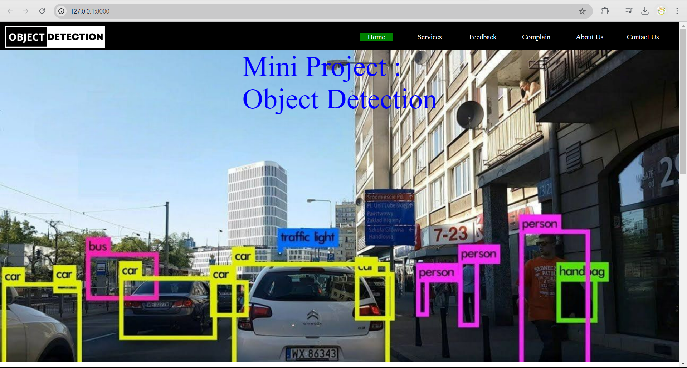
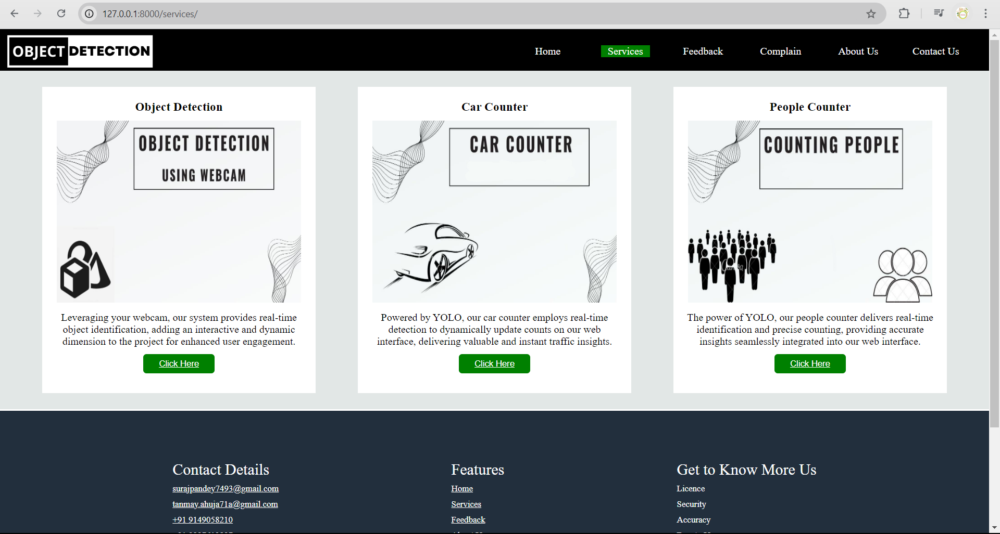
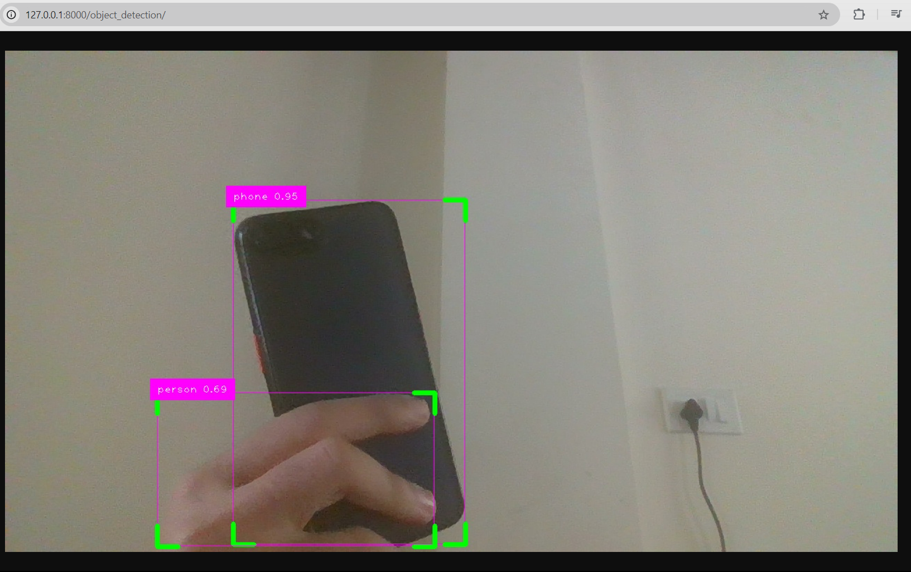
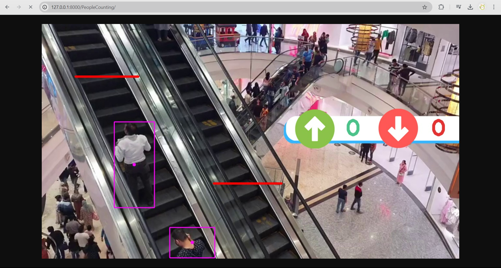
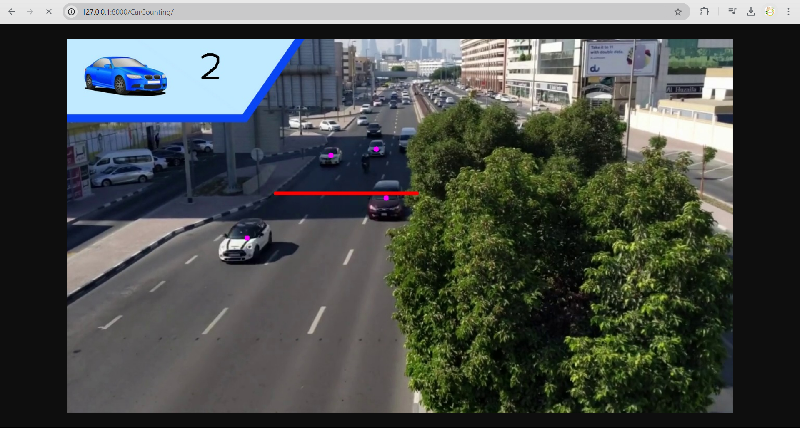
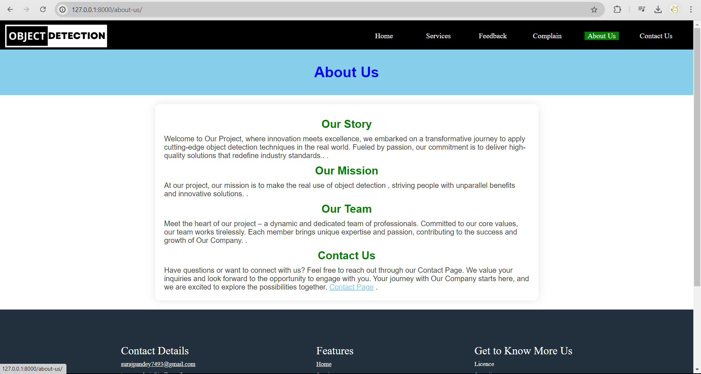
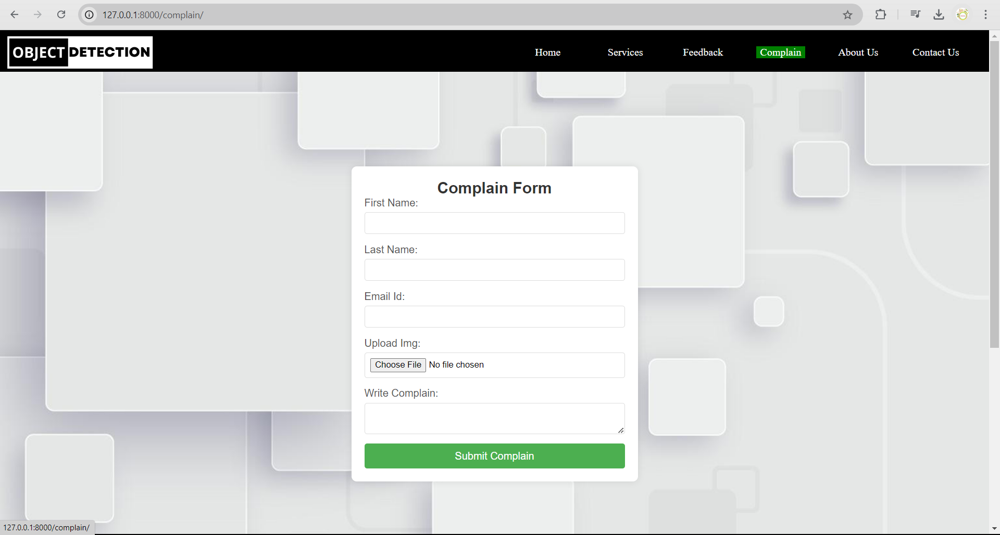
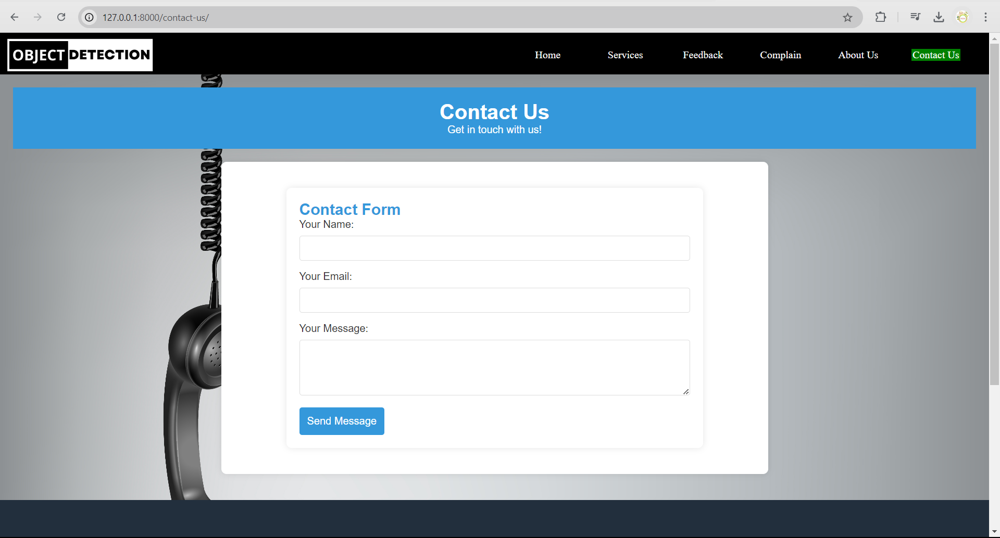

# Object Detection System

A dynamic website with real-time object detection using **YOLO (You Only Look Once)** and neural networks. This project focuses on automated **Car Counting** and **People Counting**. It also includes user-friendly forms for "Contact Us", "Complaints", and "Feedback". Built using **Django** for the backend, **SQL** for database management, and **TensorFlow** with **OpenCV** for image processing, the system provides a seamless user experience across both frontend and backend technologies.


## Interface

| Home Page | Services Page | Object Detection Page | People Counter Page |
|-------------|-------------|---------------------|-----------------------|
|  |  |  |  |

| Car Counter Page |  About page | Complain Page | Contact Us Page |
|-------------------|------------------------------|----------------------|---------------------------|
|  |  |  |  |


## Features
- **Real-time Object Detection**: Identifies and counts cars and people using YOLO.
- **User Forms**: Includes forms for submitting feedback, complaints, and contact information.
- **Responsive Design**: The frontend is designed to provide a smooth experience across devices.
- **Backend Management**: Admin access to handle feedback, complaints, and form submissions.

## Technologies Used
- **Frontend**: HTML, CSS
- **Backend**: Python, Django
- **Database**: SQL
- **Machine Learning**: TensorFlow, YOLO, OpenCV

## Installation

1. **Clone the repository**:
   ```bash
   git clone https://github.com/spsurajpandeysp/object-detection-system.git
   ```

2. **Navigate to the project directory**:
   ```bash
   cd object-detection-system
   ```

3. **Create and activate a virtual environment**:
   ```bash
   python -m venv venv
   source venv/bin/activate  # On Windows: venv\Scripts\activate
   ```

4. **Install dependencies**:
   ```bash
   pip install -r requirements.txt
   ```

5. **Apply database migrations**:
   ```bash
   python manage.py migrate
   ```

6. **Run the development server**:
   ```bash
   python manage.py runserver
   ```

7. Open your web browser and navigate to `http://127.0.0.1:8000/` to access the application.

## Usage

- **Object Detection**:Using Webcam detect object and Upload video to  count cars and people in real time.
- **Forms**: Fill out the "Contact Us", "Complaints", or "Feedback" forms to submit information.
  


## Future Improvements
- Integration with external APIs for extended data analysis.
- Adding more object classes for detection beyond cars and people.
- Enhanced UI/UX for a better user experience.

## Database Schema

- **Product Table**: Contains product details such as name, price, and stock.
- **Employee Table**: Stores employee records.
- **Customer Table**: Records customer information, including contact details and purchase history.
- **Orders Table**: Records information about placed orders and bill generation.
- **Orders History Table (optional)**: Maintains a history of all past orders for comprehensive tracking of customer activity.

---

## Contact
For any inquiries or support, feel free to contact:
- **Name**: [Suraj Pandey]
- **Email**: [surajpandey7493@gmail.com]
- **GitHub**: [https://github.com/spsurajpandeysp](https://github.com/spsurajpandeysp)]
- **My Portfolio**: [https://github.com/spsurajpandeysp](https://surajpandey.vercel.app)]


🌟 **Thank You for Taking the Time to Explore Our Project!** 🌟
